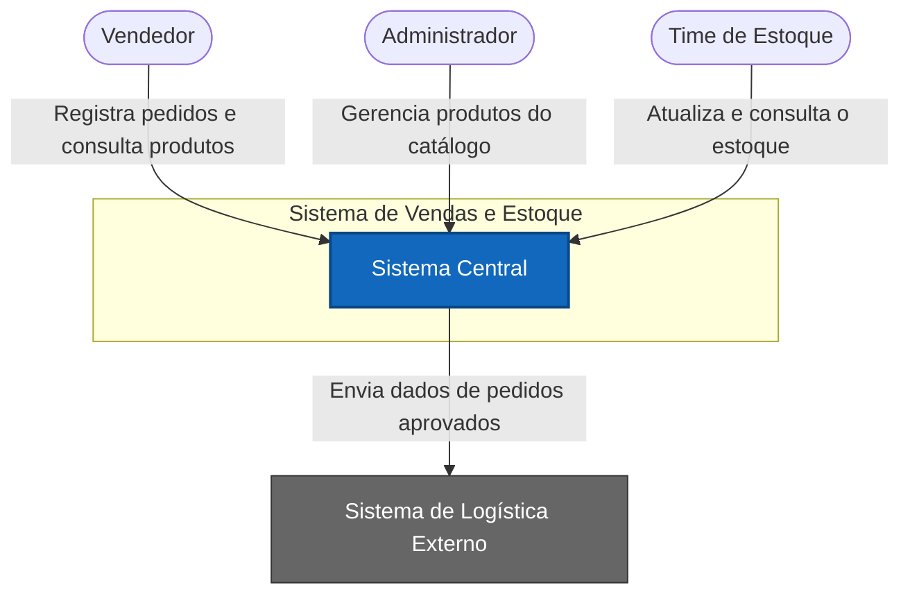

# Diagrama 1

Aqui está o diagrama de contexto:

```mermaid
graph TD
    %% Usuários
    vendedor([Vendedor])
    admin([Administrador])
    estoque([Time de Estoque])

    %% Sistema Central
    subgraph SVE [Sistema de Vendas e Estoque]
        sistema[Sistema Central]
    end

    %% Sistema Externo
    logistica[Sistema de Logística Externo]

    %% Relacionamentos
    vendedor -->|Registra pedidos e consulta produtos| sistema
    admin -->|Gerencia produtos do catálogo| sistema
    estoque -->|Atualiza e consulta o estoque| sistema
    sistema -->|Envia dados de pedidos aprovados| logistica

    style sistema fill:#1168bd,stroke:#0b4884,color:#fff,stroke-width:2px
    style logistica fill:#666,stroke:#333,color:#fff


```
